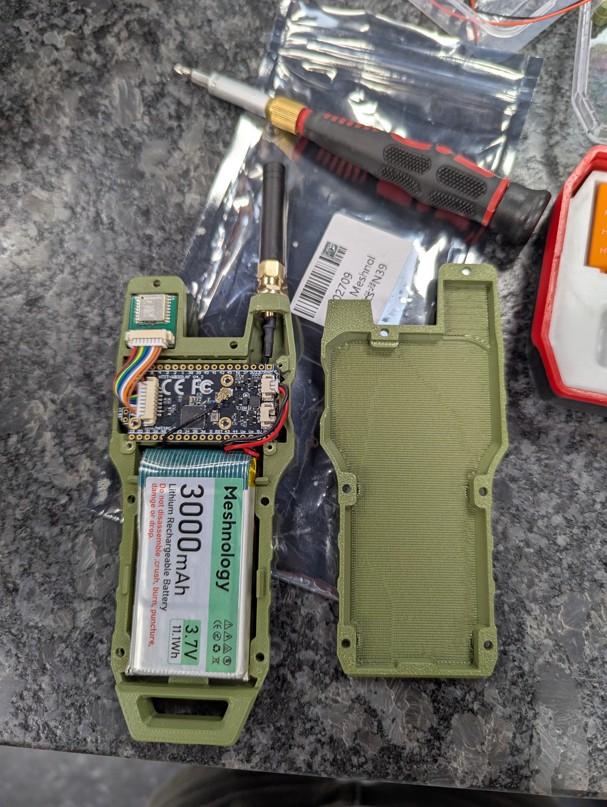

# May 2026 LILUG Meeting
*May 12th, 2026 @ [Digital Ballpark](https://maps.app.goo.gl/Uef2PiZBpZLd1n3QA)*

*Pace-notes by [Chris Trimble](https://github.com/Trimble-tech)*

## News & Small Talk
Two Linux Vulnerabilities were discovered this month; please patch your systems.
- [CopyFail Vulnerability article on Arstechnica](https://arstechnica.com/security/2026/04/as-the-most-severe-linux-threat-in-years-surfaces-the-world-scrambles/)
- [DirtyFrag Vulnerability article on Arstechnica](https://arstechnica.com/security/2026/05/linux-bitten-by-second-severe-vulnerability-in-as-many-weeks/)

## Main Discussion: Meshtastic Node Setup
In this discussion, we built three different mesh nodes and flashed them with the Meshtastic firmware.
These cheap, easily built devices can now communicate over 915mHz (US unlicensed band) peer to peer, over several kilometers.
For more information on the Meshtastic networking and project, please see the October 2025 meeting notes.

The device I was tasked with assembling was a [Heltec LoRa32v4](https://meshtastic.org/docs/hardware/devices/heltec-automation/lora32/?heltec=v4).
This device has a nice feel in hand and a decently sized battery; I note that it came with extra cables and pins to setup with either a different case or possibly solar power.

Once assembled, I connected the device to my laptop over a USB-C serial connection. The device was immediately recognized by the [Meshtastic web client](https://client.meshtastic.org) and the [Meshtastic web flasher](https://flash.meshtastic.org) but disconnected whenever I tried to use it. I discovered after some troubleshooting that I needed to add myself to the `dialout` group in order for Fedora Linux to let my account use the serial connection. This quick command and a reboot (a logout could have worked too) fixed the issue: 
    `sudo usermod -aG dialout $USER`
